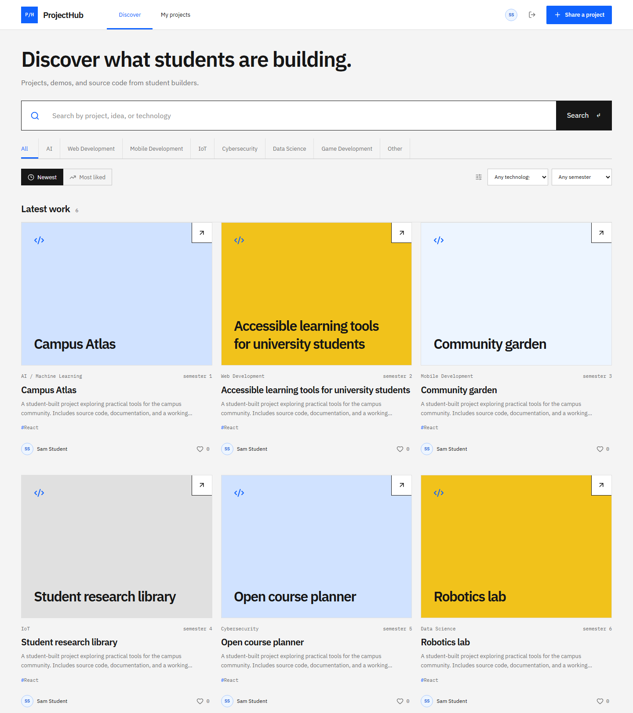
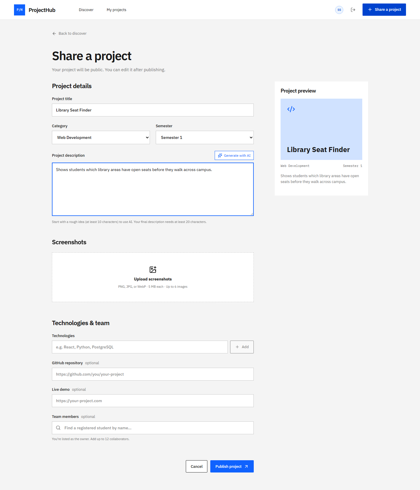

# ProjectHub

A place to share what you have been building.

ProjectHub is a student project showcase where you can keep screenshots, source code, demos, tech stack, and collaborators all in one place.

**Live demo:** https://projecthub.samyaklabs.com

## Screenshots





---

## Features

- Create, edit, and delete your projects.
- Upload screenshots up to 5 MB
- Explore projects by newest or most popular.
- Like projects and view creator profiles.
- Add registered collaborators to projects.
- Displays the languages, stars, forks and update dates of public GitHub repositories
- Sign up with email verification and reset forgotten passwords
- Generate an optional AI description draft before publishing.

## Tech stack

| Part | Tools |
| --- | --- |
Frontend | React 19, TypeScript, Vite, React Router |
Styling | Plain CSS, Lucide icons |
Backend | Node.js, Express 5, TypeScript, Zod |
| Database | PostgreSQL 17, Prisma 6 |
| Accounts | JWT for authentication, bcryptjs for password hashing, Nodemailer for sending emails |
Integrations | Cloudinary, GitHub REST API, OpenAI |
Testing | Vitest, Supertest, Playwright |

The frontend and backend are separate npm applications.

Project owners can edit their projects, while credited collaborators cannot. Each account can also like a project only once.

Browser tests check layouts across phone, tablet, and desktop sizes.

---

## Run locally

### 1. Requirements

You'll need:

- Node.js and npm
- Git
- Docker with Compose
- SMTP credentials for email verification

### 2. Clone the project and start PostgreSQL

```sh
git clone https://github.com/swaznil/project1.git
cd project1
docker compose up -d
docker compose ps
```

The database is available at `localhost:5434`.

### 3. Set up the backend

In the repository root:

```sh
cd server
npm ci
npm run setup:env
npm run db:generate
npm run db:deploy
```

Both the `.env` files are created and jwt secrets are generated in the setup script without overwriting files. Database settings are already configured to match Docker Compose.

Edit `server/.env`:

```dotenv
SMTP_HOST=smtp.gmail.com
SMTP_PORT=465
SMTP_USER=your-email@gmail.com
SMTP_PASS=your-google-app-password
SMTP_FROM=ProjectHub <your-email@gmail.com>
```

In the `server/` directory, run the API:

```sh
npm run dev
```

You can check that the API is running at:

```text
http://localhost:5000/api/v1/health
```

### 4. Start the frontend

Open another terminal at the root of the repository:

```sh
cd client
npm ci
npm run dev
```

Visit **[localhost:5173](http://localhost:5173)**. Sign up, follow the email link and verify your account, log in, and select Share a project.

Use `localhost` consistently. The client config generated will include `VITE_API_URL=/api/v1`; Vite will forward requests to port 5000.

---

## Optional integrations

Add the related variables to `server/.env` and restart the backend.

| Feature | Variables |
| --- | --- |
| Screenshot uploads | `CLOUDINARY_CLOUD_NAME`, `CLOUDINARY_API_KEY`, `CLOUDINARY_API_SECRET` |
| AI descriptions | `OPENAI_API_KEY`, optionally `OPENAI_MODEL` |
| Higher GitHub API limits | `GITHUB_TOKEN` |

Without these, you can still do most stuff. fPublic GitHub repository data can still be fetched without a token, but GitHub's unauthenticated rate limit is lower.

---

## Build

Build the frontend from `client/`:

```sh
npm run build
```

Files are output in `client/dist/`. Run/Compile the backend in `server/`:

```sh
npm run build
npm start
```

---

## AI usage

We have used AI in this project for solving different production problems while deploying the front in Vercel and AI was also used to generate metadata for testing different api endpoints in backend and frontend.