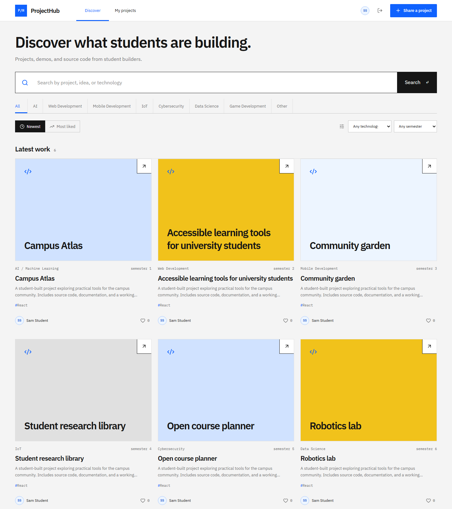
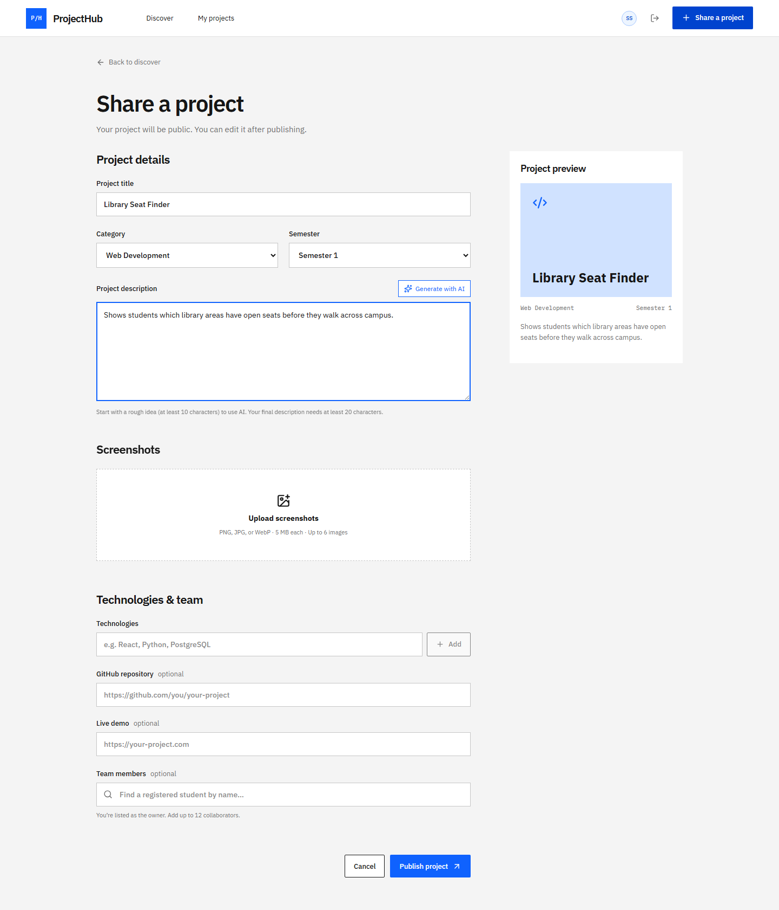

# ProjectHub

A place to show people what you have been creating.

ProjectHub is a student project exhibit for **Pixl**. It aggregates screenshots, source code, demos and the people behind a project in a single page, to quickly see what something does before forking its repo.

**Repository:** [github.com/samyaksubedi/Project-Hub](https://github.com/samyaksubedi/Project-Hub)

**Live demo:** [projecthub.samyaklabs.com](https://projecthub.samyaklabs.com/)

## A look around

Use the categories, technology and semester filters to browse projects.



Type in your project information and preview as you type.

The project editor updates the card preview as you type; no hovering is needed.



The following screenshots were taken from sample projects in the browser tests. A new database is created bare.

## What it does

- Create, edit, and remove projects of your own.
- Upload up to 6 PNG, JPEG, or WebP screenshots, up to 5 MB per file.
- Explore projects and filter by most recent or most popular.
- Set a public profile, give credit to registered co-workers and like projects.
- Display the languages, stars, forks, and update dates of public GitHub repositories.
- Sign up with email verification and reset forgotten passwords by email.
- Optionally, create a draft of a description, review it, and edit it before publishing.

## How it's built

| Part | Tools |
| --- | --- |
| Frontend | React 19, TypeScript, Vite, React Router |
| Styling | Plain CSS, Lucide icons |
| Backend | Node.js, Express 5, TypeScript, Zod |
| Database | PostgreSQL 17, Prisma 6 |
| Accounts | JWT for authentication, bcryptjs for password hashing, Nodemailer for sending emails |
| Integrations | Cloudinary, GitHub REST API, OpenAI |
| Testing | Vitest, Supertest, Playwright |

The client and server are two separate npm applications. Requests are sent through services and repositories along express routes, and Prisma will deal with the database.

Some implementation aspects are important: Only owners are allowed to change projects, credited teammates aren't allowed to edit, and the database permits one like per account per project. Browser tests validate layouts across phone, tablet and desktop.

## Run it locally

### 1. Prerequisites

Install [Node.js](https://nodejs.org/) 22.12+ with npm, Git, and Docker with Compose. Configure Docker to run Linux containers.

SMTP credentials are only needed to use registration verification and password-reset emails. The example below uses Gmail; Cloudinary, GitHub-token, and OpenAI integrations are optional.

### 2. Clone the repository and start the database

```sh
git clone https://github.com/samyaksubedi/Project-Hub.git
cd Project-Hub
docker compose up -d
docker compose ps
```

Wait until PostgreSQL is in the healthy state. It is located at localhost:5434 while Docker only runs the database.

### 3. Set up the backend

To the repository root:

```sh
cd server
npm ci
npm run setup:env
npm run db:generate
npm run db:deploy
```

The setup script creates both `.env` files and generates JWT secrets without overwriting existing files. Database settings already match Docker Compose.

To enable registration verification and password-reset emails, edit `server/.env`:

```dotenv
SMTP_HOST=smtp.gmail.com
SMTP_PORT=465
SMTP_USER=your-email@gmail.com
SMTP_PASS=your-google-app-password
SMTP_FROM=ProjectHub <your-email@gmail.com>
```

Do not use your normal password; use a Google app password. Don't commit `.env` files. Without SMTP configured, the app can start but users cannot complete account-email flows.

In the `server/` directory, run the API:

```sh
npm run dev
```

Check [localhost:5000/api/v1/health](http://localhost:5000/api/v1/health).

### 4. Start the frontend

Open another terminal at the root of the repository:

```sh
cd client
npm ci
npm run dev
```

Visit **[localhost:5173](http://localhost:5173)**. Sign up, follow the email link and verify your account, log in, and select Share a project.

Use `localhost` consistently. The client config generated will include `VITE_API_URL=/api/v1`; Vite will forward requests to port 5000.

### Optional integrations

Place these in `server/.env` and restart the backend:

| Feature | Variables |
| --- | --- |
| Screenshot uploads | `CLOUDINARY_CLOUD_NAME`, `CLOUDINARY_API_KEY`, `CLOUDINARY_API_SECRET` |
| AI drafts | `OPENAI_API_KEY`; optionally `OPENAI_MODEL` |
| Higher GitHub API limits | `GITHUB_TOKEN` |

Without these, you can still publish text-only projects and write up the descriptions yourself. Within the unauthenticated limit it is possible to perform public GitHub lookups without the requirement of a token. AI requests are subject to fees. Never put service secrets in `VITE_` variables.

## Builds and tests

Build the frontend from `client/`:

```sh
npm run build
```

Files are output in `client/dist/`. Build and run the backend from `server/`:

```sh
npm run build
npm start
```

Once PostgreSQL is running, create and migrate the test database, and perform the backend checks from `server/`:

```sh
npm run db:test:setup
npm run typecheck
npm test
```

Then run the browser checks from `client/`:

```sh
npm run typecheck
npx playwright install chromium
npm run test:e2e
```

Tests clear `projecthub_test`. Run the suites sequentially because they share it. Playwright starts its own servers on ports 5001 and 5174. External services are mocked; real email delivery and uploads need separate checks.

## Troubleshooting

If the connection to the database fails, run `docker compose ps` to verify that PostgreSQL is healthy, then check port 5434.
- No verification email: Fix smtp settings, restart backend and request another verification email from login screen.
- If API requests do not work: Verify port 5000 and ensure that `VITE_API_URL=/api/v1`.
The port in question, "Port 5173", is taken by another process: stop the offending process; Vite will not automatically switch ports.

Stop PostgreSQL: `docker compose down`. Data remains inside of the volume; when you add the `-v` it will be deleted.
